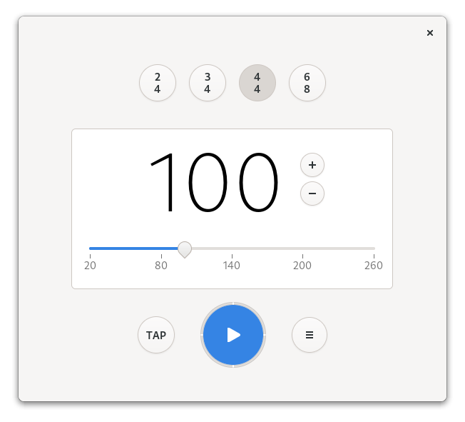

# Metronome

Practice music with a regular tempo

Metronome beats the rhythm for you, you simply need to tell it the required time signature and beats per minutes.

You can also tap to let the application guess the required beats per minute.

A boilerplate template to get started with GTK, Rust, Meson, Flatpak made for GNOME. It can be adapted for other desktop environments like elementary.

## Building with Flatpak + GNOME Builder

Metronome can be built and run with [GNOME Builder](https://wiki.gnome.org/Apps/Builder) >= 3.28.
Just clone the repo and hit the run button!

You can get Builder from [here](https://wiki.gnome.org/Apps/Builder/Downloads), and the Rust Nightly Flatpak SDK (if necessary) from [here](https://haeckerfelix.de/~repo/).

## Code Of Conduct

We follow the [GNOME Code of Conduct](/CODE_OF_CONDUCT.md).
All communications in project spaces are expected to follow it.
